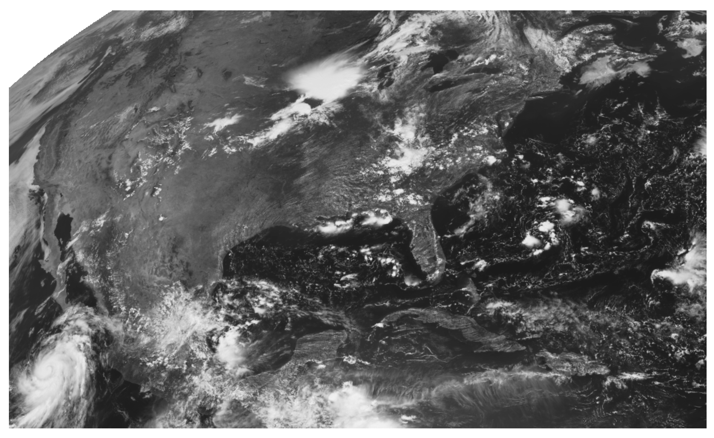

Geostationary
=============

GOES-R
------

The `Geostationary Operational Environment Satellite R-Series <https://www.goes-r.gov/>`_ is NOAA's latest geostationary set of satellites. GOES-16, GOES-17, GOES-18, and GOES-19 are part of this series. The two instruments for terrestrial weather are the `Advanced Baseline Imager (ABI) <https://www.goes-r.gov/spacesegment/abi.html>`_ and the `Geostationary Lightning Mapper (GLM) <https://www.goes-r.gov/spacesegment/glm.html>`_.

.. image:: ../static/images/GOES-East_geosphere.png
  :width: 500
  :alt: GOES-East full disk true-color image.

Advanced Baseline Imager (ABI)
~~~~~~~~~~~~~~~~~~~~~~~~~~~~~~

ABI consists of 16 channels and passively senses emitted and reflected radiation from visible, near-infrared, and longwave-infrared parts of the EM spectrum. The table summarizes some characteristics of the bands.

.. image:: ../static/images/ABI_table.png
  :width: 500
  :alt: Table with ABI band characteristics

Quick Reference Guides
,,,,,,,,,,,,,,,,,,,,,,

Here is a table with handy quick reference guides for the ABI Level 1b (L1b) bands.

+---------------+--------------------------+--------------------+-------------------------------------------------------------------------------------+
| Band Number   | Band Nickname            | Central Wavelength | Quick Guide                                                                         |
+===============+==========================+====================+=====================================================================================+
|    1          | Blue band                | 0.47 µm            | `Link <http://cimss.ssec.wisc.edu/goes/OCLOFactSheetPDFs/ABIQuickGuide_Band01.pdf>`_|
+---------------+--------------------------+--------------------+-------------------------------------------------------------------------------------+
|    2          | Red band                 | 0.64 µm            | `Link <http://cimss.ssec.wisc.edu/goes/OCLOFactSheetPDFs/ABIQuickGuide_Band02.pdf>`_|
+---------------+--------------------------+--------------------+-------------------------------------------------------------------------------------+
|    3          | Vegetation band          | 0.86 µm            | `Link <http://cimss.ssec.wisc.edu/goes/OCLOFactSheetPDFs/ABIQuickGuide_Band03.pdf>`_|
+---------------+--------------------------+--------------------+-------------------------------------------------------------------------------------+
|    4          | Cirrus band              | 1.38 µm            | `Link <http://cimss.ssec.wisc.edu/goes/OCLOFactSheetPDFs/ABIQuickGuide_Band04.pdf>`_|
+---------------+--------------------------+--------------------+-------------------------------------------------------------------------------------+
|    5          | Snow/Ice band            | 1.61 µm            | `Link <http://cimss.ssec.wisc.edu/goes/OCLOFactSheetPDFs/ABIQuickGuide_Band05.pdf>`_|
+---------------+--------------------------+--------------------+-------------------------------------------------------------------------------------+
|    6          | Cloud Particle Size      | 2.24 µm            | `Link <http://cimss.ssec.wisc.edu/goes/OCLOFactSheetPDFs/ABIQuickGuide_Band06.pdf>`_|
+---------------+--------------------------+--------------------+-------------------------------------------------------------------------------------+
|    7          | Shortwave infrared       | 3.9 µm             | `Link <http://cimss.ssec.wisc.edu/goes/OCLOFactSheetPDFs/ABIQuickGuide_Band07.pdf>`_|
+---------------+--------------------------+--------------------+-------------------------------------------------------------------------------------+
|    8          | Upper-level water vapor  | 6.19 µm            | `Link <http://cimss.ssec.wisc.edu/goes/OCLOFactSheetPDFs/ABIQuickGuide_Band08.pdf>`_|
+---------------+--------------------------+--------------------+-------------------------------------------------------------------------------------+
|    9          | Mid-level water vapor    | 6.95 µm            | `Link <http://cimss.ssec.wisc.edu/goes/OCLOFactSheetPDFs/ABIQuickGuide_Band09.pdf>`_|
+---------------+--------------------------+--------------------+-------------------------------------------------------------------------------------+
|    10         | Low-level water vapor    | 7.34 µm            | `Link <http://cimss.ssec.wisc.edu/goes/OCLOFactSheetPDFs/ABIQuickGuide_Band10.pdf>`_|
+---------------+--------------------------+--------------------+-------------------------------------------------------------------------------------+
|    11         | Infrared cloud-top phase | 8.6 µm             | `Link <http://cimss.ssec.wisc.edu/goes/OCLOFactSheetPDFs/ABIQuickGuide_Band11.pdf>`_|
+---------------+--------------------------+--------------------+-------------------------------------------------------------------------------------+
|    12         | Ozone band               | 9.6 µm             | `Link <http://cimss.ssec.wisc.edu/goes/OCLOFactSheetPDFs/ABIQuickGuide_Band12.pdf>`_|
+---------------+--------------------------+--------------------+-------------------------------------------------------------------------------------+
|    13         | Infrared clean window    | 10.35 µm           | `Link <http://cimss.ssec.wisc.edu/goes/OCLOFactSheetPDFs/ABIQuickGuide_Band13.pdf>`_|
+---------------+--------------------------+--------------------+-------------------------------------------------------------------------------------+
|    14         | Infrared window          | 11.2 µm            | `Link <http://cimss.ssec.wisc.edu/goes/OCLOFactSheetPDFs/ABIQuickGuide_Band14.pdf>`_|
+---------------+--------------------------+--------------------+-------------------------------------------------------------------------------------+
|    15         | Infrared dirty window    | 12.3 µm            | `Link <http://cimss.ssec.wisc.edu/goes/OCLOFactSheetPDFs/ABIQuickGuide_Band15.pdf>`_|
+---------------+--------------------------+--------------------+-------------------------------------------------------------------------------------+
|    16         | Carbon dioxide           | 13.3 µm            | `Link <http://cimss.ssec.wisc.edu/goes/OCLOFactSheetPDFs/ABIQuickGuide_Band16.pdf>`_|
+---------------+--------------------------+--------------------+-------------------------------------------------------------------------------------+

An important Level 2 (L2) product is the "Cloud and Moisture Imagery" (CMI), which is essentially each the radiance from each L1b channel converted to reflectance or brightness temperature. Here is the `quick guide <https://www.goes-r.gov/education/docs/fs_imagery.pdf>`_ for the CMI products. Here is a table with handy quick reference guides for the baseline ABI L2 products.

+------------------------------------------+--------------------------------------------------------------------------------------------------------------------+
| Baseline Level 2 Product                 | Quick Guide                                                                                                        |
+==========================================+====================================================================================================================+
| Aerosol Detection Product (ADP)          | `Link <http://cimss.ssec.wisc.edu/goes/OCLOFactSheetPDFs/ABIQuickGuide_BaselineAerosolDetection.pdf>`_             |
+------------------------------------------+--------------------------------------------------------------------------------------------------------------------+
| Aerosol Optical Depth (AOD)              | `Link <http://cimss.ssec.wisc.edu/goes/OCLOFactSheetPDFs/ABIQuickGuide_BaselineAerosolOpticalDepth.pdf>`_          |
+------------------------------------------+--------------------------------------------------------------------------------------------------------------------+
| Derived Motion Wind vectors              | `Link <http://cimss.ssec.wisc.edu/goes/OCLOFactSheetPDFs/ABIQuickGuide_BaselineDerivedMotionWinds.pdf>`_           |
+------------------------------------------+--------------------------------------------------------------------------------------------------------------------+
| Derived Stability Indices                | `Link <http://cimss.ssec.wisc.edu/goes/OCLOFactSheetPDFs/ABIQuickGuide_BaselineDerivedStabilityIndices.pdf>`_      |
+------------------------------------------+--------------------------------------------------------------------------------------------------------------------+
| Clear Sky Mask                           | `Link <http://cimss.ssec.wisc.edu/goes/OCLOFactSheetPDFs/ABIQuickGuide_BaselineClearSkyMask.pdf>`_                 |
+------------------------------------------+--------------------------------------------------------------------------------------------------------------------+
| Cloud Phase                              | `Link <http://cimss.ssec.wisc.edu/goes/OCLOFactSheetPDFs/ABIQuickGuide_BaselineCloudPhase.pdf>`_                   |
+------------------------------------------+--------------------------------------------------------------------------------------------------------------------+
| Cloud-top Height                         | `Link <http://cimss.ssec.wisc.edu/goes/OCLOFactSheetPDFs/ABIQuickGuide_BaselineCloudTopHeight.pdf>`_               |
+------------------------------------------+--------------------------------------------------------------------------------------------------------------------+
| Cloud-top Temperature                    | `Link <http://cimss.ssec.wisc.edu/goes/OCLOFactSheetPDFs/ABIQuickGuide_BaselineCloudTopTemperature.pdf>`_          |
+------------------------------------------+--------------------------------------------------------------------------------------------------------------------+
| Cloud-top Pressure                       | `Link <http://cimss.ssec.wisc.edu/goes/OCLOFactSheetPDFs/ABIQuickGuide_BaselineCloudTopPressure.pdf>`_             |
+------------------------------------------+--------------------------------------------------------------------------------------------------------------------+
| Cloud-top Particle Size Distribution     | `Link <http://cimss.ssec.wisc.edu/goes/OCLOFactSheetPDFs/ABIQuickGuide_BaselineCloudParticleSizeDistribution.pdf>`_|
+------------------------------------------+--------------------------------------------------------------------------------------------------------------------+
| Cloud Optical Depth                      | `Link <http://cimss.ssec.wisc.edu/goes/OCLOFactSheetPDFs/ABIQuickGuide_BaselineCloudOpticalDepth.pdf>`_            |
+------------------------------------------+--------------------------------------------------------------------------------------------------------------------+
| Volcanic Ash Detection                   | `Link <https://cimss.ssec.wisc.edu/goes/OCLOFactSheetPDFs/QuickGuide_GOESR_VolcanicAsh.pdf>`_                      |
+------------------------------------------+--------------------------------------------------------------------------------------------------------------------+
| IFR Probability                          | `Link <http://cimss.ssec.wisc.edu/goes/OCLOFactSheetPDFs/QuickGuide_GOES16_IFRProbability.pdf>`_                   |
+------------------------------------------+--------------------------------------------------------------------------------------------------------------------+
| Cloud Thickness                          | `Link <http://cimss.ssec.wisc.edu/goes/OCLOFactSheetPDFs/QuickGuide_GOES16_CloudThickness.pdf>`_                   |
+------------------------------------------+--------------------------------------------------------------------------------------------------------------------+
| Fire/Hotspot Characterization            | `Link <http://cimss.ssec.wisc.edu/goes/OCLOFactSheetPDFs/QuickGuide_GOESR_FireHotSpot_v2.pdf>`_                    |
+------------------------------------------+--------------------------------------------------------------------------------------------------------------------+
| Land Surface Temperature                 | `Link <http://cimss.ssec.wisc.edu/goes/OCLOFactSheetPDFs/QuickGuide_GOESR_LandSurfaceTemperature.pdf>`_            |
+------------------------------------------+--------------------------------------------------------------------------------------------------------------------+
| Ice Concentration                        | `Link <http://cimss.ssec.wisc.edu/goes/OCLOFactSheetPDFs/QuickGuide_GOESR_IceConcentration.pdf>`_                  |
+------------------------------------------+--------------------------------------------------------------------------------------------------------------------+
| Ice Surface Temperature                  | `Link <http://cimss.ssec.wisc.edu/goes/OCLOFactSheetPDFs/QuickGuide_GOESR_IceSurfaceTemperature.pdf>`_             |
+------------------------------------------+--------------------------------------------------------------------------------------------------------------------+
| Ice Age/Thickness                        | `Link <http://cimss.ssec.wisc.edu/goes/OCLOFactSheetPDFs/ABIQuickGuide_GOESR_L2IceAgeIceThickness.pdf>`_           |
+------------------------------------------+--------------------------------------------------------------------------------------------------------------------+
| Ice Motion                               | `Link <http://cimss.ssec.wisc.edu/goes/OCLOFactSheetPDFs/ABIQuickGuide_GOESR_L2IceMotion.pdf>`_                    |
+------------------------------------------+--------------------------------------------------------------------------------------------------------------------+
| Snow Fraction                            | `Link <http://cimss.ssec.wisc.edu/goes/OCLOFactSheetPDFs/QuickGuide_GOESR_SnowFraction.pdf>`_                      |
+------------------------------------------+--------------------------------------------------------------------------------------------------------------------+

Modes and sectors
,,,,,,,,,,,,,,,,,

ABI has multiple scan modes. In mode 4, or continuous full disk mode, the ABI produces a full disk (Western Hemisphere) image every five minutes. In mode 3, or flex mode, the ABI concurrently produces a full disk every 15 minutes, a CONUS image (resolution 3000 km by 5000 km) every five minutes, and two mesoscale domains (resolution 1000 km by 1000 km at the satellite sub-point) every 60 seconds or one sub-domain every 30 seconds. Mode 6, or 10-minute flex mode, which became the default operating mode for GOES-16 and GOES-17 in April 2019, provides a full disk image every 10 minutes, a CONUS (GOES-East) / PACUS (GOES-West) image every five minutes, and images from both mesoscale domains every 60 seconds (or one sub-domain every 30 seconds). All ABI bands have on-orbit calibration.

The pair of images below shows the increasing pixel area further away from nadir. The default east position is at 75 degrees west longitude; the default west position is at 137 degrees west longitude. Within the full-disk image, there is outlined the CONUS/PACUS and sample mesoscale sector domains. 

.. image:: ../static/images/GOES_pixel-areas.png
  :width: 800
  :alt: Two images with GOES pixel areas and sector boxes.

Geostationary Lightning Mapper (GLM)
~~~~~~~~~~~~~~~~~~~~~~~~~~~~~~~~~~~~

The GLM is the first-of-its-kind optical sensor from geostationary orbit. Its has a single near-infrared band at 777.4 nm. The instrument's horizontal resolution ranges from about 8 km to 12 km. The image below shows the GLM's field-of-view (FOV) [image credit: Brian Blaylock]. 

.. image:: ../static/images/GLM_field-of-view.png
  :width: 800
  :alt: The GLM's field of view (credit: Brian Blaylock).

This set of `quick guides <https://www.star.nesdis.noaa.gov/goes/documents/GLM_Quick_Guides_May_2019.pdf>`_ provides a great overview of GLM events, groups, and flashes that the `Lightning Cluster-Filter Algorithm (LCFA) <https://www.star.nesdis.noaa.gov/goesr/docs/ATBD/LCFA.pdf>`_ creates, as well as information on higher-level gridded products, such as flash-extent density, average flash area, and total optical energy.
The Level 2 files are produced every 20 seconds, with output from the LCFA. That is, the centroids of events, groups, and flashes. These point-based products are parallax-corrected using a "lightning ellipsoid," which assumes a cloud height based on location and time of the year [FIXME: check time of year]. These files are available at all of the same sources that ABI is (see :ref:`Data Access`). 

Gridded GLM products
,,,,,,,,,,,,,,,,,,,,

The best way to create the gridded products it to use `glmtools <https://github.com/deeplycloudy/glmtools>`_. This `page <https://github.com/deeplycloudy/glmtools/blob/master/docs/index.rst>`_ provides installation instructions and some examples of how to use the command-line utility, ``make_GLM_grids.py``. From an operational perspective, the flash-extent density and minimum flash area (both available with ``glmtools``) are the most used products. The flash-extent density provides the count of flashes that traverses a given pixel, whereas low minimum flash areas can indicate new storm updrafts. **Note well: The gridded GLM products remove the parallax correction from the LCFA flashes.** Thus, they match the un-corrected ABI data.

Data Viewing
~~~~~~~~~~~~

There a number of excellent websites for GOES-16 imagery. Here are a few of my favorites:

- `CIMSS CSPP Geosphere <https://geosphere.ssec.wisc.edu/#coordinate:0,0;>`_
- `CIRA Slider <https://rammb-slider.cira.colostate.edu/>`_
- `College of DuPage <weather.cod.edu/satrad>`_
- `NOAA GOES imagery viewer <https://www.star.nesdis.noaa.gov/goes/>`_

Data Access
~~~~~~~~~~~

In lieu of a direct-broadcast antenna or LDM connection, the best way to obtain GOES-R data is probably through `Amazon's cloud <https://registry.opendata.aws/noaa-goes/>`_ (or `Google <https://console.cloud.google.com/marketplace/product/noaa-public/goes>`_, or `Microsoft <https://planetarycomputer.microsoft.com/catalog?filter=goes>`_). `GOES-2-Go <https://goes2go.readthedocs.io/en/latest/>`_ is a handy tool to download data from AWS and create some quick-look images. Or you can use ``s3fs`` to directly access GOES-R data. NOAA's `CLASS <https://www.class.noaa.gov/>`_ is another option.

Using ``s3fs``
,,,,,,,,,,,,,,

On Linux command line, first ``pip install s3fs``. Then using Python,

.. code-block:: Python

    import s3fs
    import xarray as xr
    from datetime import datetime
    import matplotlib.pyplot as plt

    fs = s3fs.S3FileSystem(anon=True) #connect to s3 bucket!

    # Get the C02 CMI for 10 August 2020 18:01 UTC
    abidt = datetime(2020,8,10,18,1)
    file_location = fs.glob(abidt.strftime('s3://noaa-goes16/ABI-L2-CMIPC/%Y/%j/%H/*C02*_s%Y%j%H%M*.nc'))
    file_ob = [fs.open(file) for file in file_location]
    ds = xr.open_mfdataset(file_ob, combine='nested', concat_dim='time')
    ch02 = ds['Rad'][0].data.compute()

    # Make the image
    # Note: I applied a square-root enhancement to make the land stick out more, but it is not necessary.
    plt.imshow(np.sqrt(ch02), cmap="Greys_r")
    plt.axis('off')
    plt.show()

Using `GOES-2-Go <https://goes2go.readthedocs.io/en/latest/>`_
,,,,,,,,,,,,,,,,,,,,,,,,,,,,,,,,,,,,,,,,,,,,,,,,,,,,,,,,,,,,,,

Here we use ``goes2go`` to get L1b data for two infrared bands, channels 08 and 13. We will convert them to brightness temperature ourselves.

.. code-block:: Python

    from goes2go import GOES
    import xarray as xr
    import matplotlib.pyplot as plt

    G = GOES(satellite=16, product="ABI-L1b-Rad", domain='C', bands=[8,13]) # leave out `bands` keyword if you want all channels.

    # Download the latest available
    ds = G.latest(download=False)  # `download=False` means reading from AWS to RAM directly.

    # Convert to numpy.ndarray and convert to BT

    # constants for ch08
    planck_fk1 = ds['planck_fk1'].data[0]
    planck_fk2 = ds['planck_fk2'].data[0]
    planck_bc1 = ds['planck_bc1'].data[0]
    planck_bc2 = ds['planck_bc2'].data[0]

    ch08 = ds.Rad[0].data
    ch08 = (planck_fk2 / (np.log((planck_fk1 / ch08) + 1)) - planck_bc1) / planck_bc2

    # constants for ch13
    planck_fk1 = ds['planck_fk1'].data[1]
    planck_fk2 = ds['planck_fk2'].data[1]
    planck_bc1 = ds['planck_bc1'].data[1]
    planck_bc2 = ds['planck_bc2'].data[1]

    ch13 = ds.Rad[1].data
    ch13 = (planck_fk2 / (np.log((planck_fk1 / ch13) + 1)) - planck_bc1) / planck_bc2
    
    fig,ax = plt.subplots(nrows=1, ncols=2, figsize=(12,5))
    ax[0].imshow(ch08, cmap="plasma")
    ax[0].axis('off')
    ax[0].set_title('CH08 upper-level water vapor')
    ax[1].imshow(ch13, cmap="viridis")
    ax[1].axis('off')
    ax[1].set_title('CH13 clean IR-window')

.. image:: ../static/images/ir-ch08-ch13.png
  :width: 900
  :alt: GOES-East CONUS IR (CH08 + CH13) image.

Additional Resources
~~~~~~~~~~~~~~~~~~~~

- `Beginner's Guide to GOES-R Series Data <https://noaa-goes16.s3.amazonaws.com/Version1.1_Beginners_Guide_to_GOES-R_Series_Data.pdf>`_
- `GOES-R Series Data Book <https://www.goes-r.gov/downloads/resources/documents/GOES-RSeriesDataBook.pdf>`_

Himawari
--------

Advanced Himawari Imager (AHI)
~~~~~~~~~~~~~~~~~~~~~~~~~~~~~~

Meteosat Third Generation (MTG)
-------------------------------

Flexible Combined Imager (FCI)
~~~~~~~~~~~~~~~~~~~~~~~~~~~~~~

Lightning Imager (LI)
~~~~~~~~~~~~~~~~~~~~~

