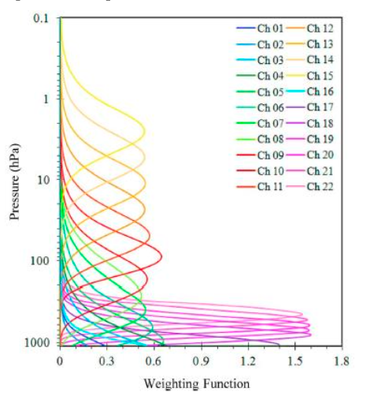

Low-Earth orbit
===============

JPSS
----

The `Joint Polar Satellite System (JPSS) <https://www.nesdis.noaa.gov/our-satellites/currently-flying/joint-polar-satellite-system>`_ is NOAA's low-earth orbitting satellite program. JPSS satellites circle the Earth from pole to pole and cross the equator about 14 times a day in the afternoon orbit to provide full global coverage twice a day. JPSS data is very important for numerical weather forecasting in the U.S. and deliver critical observations during severe weather events like hurricanes and blizzards. JPSS consists of 5 satellites:

- Suomi NPP
- NOAA 20
- NOAA 21
- JPSS 3 (will be NOAA 22)
- JPSS 4 (will be NOAA 23)

Each satellite has a VIS/IR imager (VIIRS), an IR sounder (CrIS), a microwave sounder (ATMS), and an ozone mapper (OMPS).

.. image:: ../_static/images/JPSS-Constellation-2023.jpg
    :width: 400
    :alt: JPSS constellation cartoon

The bubble chart below lists the different products from JPSS instruments. SDRs are Level-1b reprocessed Sensor Data Records. The SDRs are used as input to produce numerous Environmental Data Record (EDRs), which can be considered "Level-2" products. Most users shouldn't ever have to look at Raw Data Records (RDRs), which are the raw Level-1 data. The figure is courtesy of Amy Huff and Rebekah Esmaili (see `https://github.com/jpss-nodd/python-scripts <https://github.com/jpss-nodd/python-scripts>`_).

.. image:: ../_static/images/JPSS_Products_Bubble_Chart.jpg
    :width: 500
    :alt: Bubble chart with JPSS instrument products

VIIRS
~~~~~

The Visible Infrared Imaging Radiometer Suite, VIIRS, is a scanning radiometer with 5 high-resolution Imagery bands (or I-bands), 16 Moderate resolution bands (M-bands) and a Day/Night band (DNB). The JPSS satellites are in the same orbital plane as NASA's A-Train constellation but at a higher altitude (JPSS altitude is about 824 km). The JPSS satellites are sun synchronous with an equator crossing time of 1330 (local time).

A rotating mirror reflects radiation onto a set of CCD detectors; a single scan relates to a rotation of the mirror. A single VIIRS scan is completed in 1.779 seconds - the mirror rotation rate is slightly faster than the spec but is within tolerance. The M bands and the day/night band have 16 detectors per scan (750 m spatial resolution per pixel), while the I bands have 32 detectors per scan (375 m resolution per pixel).

VIIRS has a swath of about 3040 km in the cross-track direction, while MODIS has a swath width of 2330 km. With VIIRS, there are no coverage gaps in the Tropics as there are with MODIS.

This table helps summarize the VIIRS channels.

+-------------+---------------------+------------------+---------------+
| Band Number |  Central Wavelength | Nadir Resolution | Gain          |
+=============+=====================+==================+===============+
|    I-1      |   0.640 µm          |   375 m          | single        |
+-------------+---------------------+------------------+---------------+
|    I-2      |   0.865 µm          |   375 m          | single        |
+-------------+---------------------+------------------+---------------+
|    I-3      |   1.61 µm           |   375 m          | single        |
+-------------+---------------------+------------------+---------------+
|    I-4      |   3.74 µm           |   375 m          | single        |
+-------------+---------------------+------------------+---------------+
|    I-5      |   11.45 µm          |   375 m          | single        |
+-------------+---------------------+------------------+---------------+
|    M-1      |   0.412 µm          |   750 m          | dual          |
+-------------+---------------------+------------------+---------------+
|    M-2      |   0.445 µm          |   750 m          | dual          |
+-------------+---------------------+------------------+---------------+
|    M-3      |   0.488 µm          |   750 m          | dual          |
+-------------+---------------------+------------------+---------------+
|    M-4      |   0.555 µm          |   750 m          | dual          |
+-------------+---------------------+------------------+---------------+
|    M-5      |   0.672 µm          |   750 m          | dual          |
+-------------+---------------------+------------------+---------------+
|    M-6      |   0.746 µm          |   750 m          | single        |
+-------------+---------------------+------------------+---------------+
|    M-7      |   0.865 µm          |   750 m          | dual          |
+-------------+---------------------+------------------+---------------+
|    M-8      |   1.24 µm           |   750 m          | single        |
+-------------+---------------------+------------------+---------------+
|    M-9      |   1.38 µm           |   750 m          | single        |
+-------------+---------------------+------------------+---------------+
|    M-10     |   1.61 µm           |   750 m          | single        |
+-------------+---------------------+------------------+---------------+
|    M-11     |   2.25 µm           |   750 m          | single        |
+-------------+---------------------+------------------+---------------+
|    M-12     |   3.70 µm           |   750 m          | single        |
+-------------+---------------------+------------------+---------------+
|    M-13     |   4.05 µm           |   750 m          | dual          |
+-------------+---------------------+------------------+---------------+
|    M-14     |   8.55 µm           |   750 m          | single        |
+-------------+---------------------+------------------+---------------+
|    M-15     |   10.76 µm          |   750 m          | single        |
+-------------+---------------------+------------------+---------------+
|    M-16     |   12.01 µm          |   750 m          | single        |
+-------------+---------------------+------------------+---------------+
|    DNB      |   0.7 µm            |   500 m          | multiple      |
+-------------+---------------------+------------------+---------------+

Geolocation files
,,,,,,,,,,,,,,,,,

Geolocation files are produced separately. Here are their codes:

* I-band SDR geolocation files

  * GIMGO: projected onto smooth ellipsoid (WGS84 ellipsoid)

  * GITCO: parallax-corrected for terrain

* M-band SDR geolocation files

  * GMODO: projected onto smooth ellipsoid

  * GMTCO: parallax-corrected for terrain

* Day/Night Band geolocation file

  * GDNBO: projected onto smooth ellipsoid 

* EDR geolocation files (use ground-track Mercator projection)

  * GIGTO: I-band EDR geolocation

  * GMGTO: M-band EDR geolocation

  * GNCCO: Day/Night Band EDR (NCC) geolocation

.. seealso::

  * `VIIRS Imagery EDR User's Guide <https://rammb.cira.colostate.edu/projects/npp/VIIRS_Imagery_EDR_Users_Guide.pdf>`_
  * `VIIRS ATBD <https://www.star.nesdis.noaa.gov/jpss/documents/ATBD/D0001-M01-S01-003_JPSS_ATBD_VIIRS-SDR_E.pdf>`_

Data Viewing
,,,,,,,,,,,,

* `CIRA Slider <https://rammb-slider.cira.colostate.edu/?sat=jpss&sec=northern_hemisphere&x=14976&y=16544&z=0&angle=0&im=12&ts=1&st=0&et=0&speed=130&motion=loop&maps%5Bborders%5D=white&mhidden%5Bborders%5D=1&p%5B0%5D=cira_geocolor&opacity%5B0%5D=1&pause=0&slider=-1&hide_controls=0&mouse_draw=0&follow_feature=0&follow_hide=0&s=rammb-slider&draw_color=FFD700&draw_width=6>`_
* `VIIRS Today <https://ge.ssec.wisc.edu/viirs-today/>`_

Data Access
,,,,,,,,,,,

* `NASA LAADS <https://ladsweb.modaps.eosdis.nasa.gov/search/>`_

  * Can search by dataset, time, and location

* University of Wisconsin `SIPS <https://sips.ssec.wisc.edu/products>`_

* `NOAA Open Data Dissemination -- JPSS <https://registry.opendata.aws/noaa-jpss/>`_

Notebooks
,,,,,,,,,

Check out the notebook below for an example on how to process and visualize VIIRS data (`source notebook <https://colab.research.google.com/drive/1CjMcLrABlFsq80PDtEhpNyHJSL4tuw_Q?usp=sharing>`_).

.. toctree::

    Processing VIIRS

.. seealso::

  * https://github.com/jpss-nodd/python-scripts

    * For downloading and visualizing JPSS VIIRS data

CrIS
~~~~

The Cross-track Infrared Sounder, CrIS, is a Fourier Transform Spectrometer that provides high-resolution, three-dimensional temperature, pressure, and moisture profiles. These soundings are used to enhance weather forecasts and to support the monitoring of climate and environmental conditions. CrIS measures infrared radiation emitted by the Earth's surface and atmosphere.

CrIS works in conjunction with the Advanced Technology Microwave Sounder (ATMS) to provide soundings in both clear and cloudy conditions. It scans in a step-scan fashion, observing a 3x3 array of Fields of View (FOVs) at each step. Each individual FOV has a nadir resolution of approximately 14 km. The full array is called a Field of Regard (FOR) and covers an area of roughly 50 km x 50 km. The instrument has a swath width of about 2200 km, achieving full global coverage in approximately 12 hours.

The CrIS instrument has 2211 spectral channels across three bands:

+----------------+-----------------------------+-------------------+
| Band           | Spectral Range              | Number of Channels|
+================+=============================+===================+
| Long-wave IR   | 650 - 1095 $cm^{-1}$        | 713               |
| (LWIR)         | (9.14 - 15.38 µm)           |                   |
+----------------+-----------------------------+-------------------+
| Mid-wave IR    | 1210 - 1750 $cm^{-1}$       | 865               |
| (MWIR)         | (5.71 - 8.26 µm)            |                   |
+----------------+-----------------------------+-------------------+
| Short-wave IR  | 2155 - 2550 $cm^{-1}$       | 633               |
| (SWIR)         | (3.92 - 4.64 µm)            |                   |
+----------------+-----------------------------+-------------------+

.. seealso::

  * `CrIS Fact Sheet <https://www.nesdis.noaa.gov/s3/2023-10/JPSS-Instrument-Fact-Sheet_CrIS.pdf>`_
  * `CrIS ATBD <https://www.star.nesdis.noaa.gov/jpss/documents/ATBD/D0001-M01-S01-002_JPSS_ATBD_CRIS-SDR_fsr_20180614.pdf>`_

Data Access
,,,,,,,,,,,

* `NOAA CLASS <https://www.class.noaa.gov/>`_
* `NOAA Open Data Dissemination -- JPSS <https://registry.opendata.aws/noaa-jpss/>`_

ATMS
~~~~

The Advanced Technology Microwave Sounder, ATMS, is a cross-track scanning microwave sounder that provides atmospheric temperature and moisture profiles. A key advantage of microwave sounding is its ability to penetrate clouds, providing valuable data in all weather conditions. ATMS data is crucial for numerical weather prediction models and is used in synergy with the infrared observations from CrIS.

ATMS has 22 microwave channels spanning a frequency range from 23 GHz to 183 GHz. These channels are strategically placed to measure different atmospheric properties. The lower-frequency channels provide information on surface temperature and emissivity, while channels around the 50-60 GHz oxygen absorption band provide temperature profiles. Channels around the 183 GHz water vapor absorption line provide moisture profiles.

The spatial resolution of ATMS varies with frequency. Higher-frequency channels have a nadir resolution of 15.8 km, while lower-frequency channels have a resolution of up to 74.8 km. The instrument has a wide swath of approximately 2600 km, ensuring global coverage.

+---------+--------------------+-----------------------------------+
| Channel | Frequency (GHz)    | Primary Purpose                   |
+=========+====================+===================================+
|    1    |    23.8            | Water Vapor Burden                |
+---------+--------------------+-----------------------------------+
|    2    |    31.4            | Water Vapor Burden                |
+---------+--------------------+-----------------------------------+
|    3    |    50.3            | Surface Emissivity, Precipitation |
+---------+--------------------+-----------------------------------+
|    4    |    51.76           | Temperature Sounding (Low Trop)   |
+---------+--------------------+-----------------------------------+
|    5    |    52.8            | Temperature Sounding (Low Trop)   |
+---------+--------------------+-----------------------------------+
|    6    | 53.596±0.115       | Temperature Sounding (Mid Trop)   |
+---------+--------------------+-----------------------------------+
|    7    |    54.4            | Temperature Sounding (Mid Trop)   |
+---------+--------------------+-----------------------------------+
|    8    |    54.94           | Temperature Sounding (Upper Trop) |
+---------+--------------------+-----------------------------------+
|    9    |    55.5            | Temperature Sounding (Tropopause) |
+---------+--------------------+-----------------------------------+
|   10    |    57.29           | Temperature Sounding (Strat)      |
+---------+--------------------+-----------------------------------+
|   11    | 57.29±0.217        | Temperature Sounding (Strat)      |
+---------+--------------------+-----------------------------------+
|   12    | 57.29±0.322±0.048  | Temperature Sounding (Strat)      |
+---------+--------------------+-----------------------------------+
|   13    | 57.29±0.322±0.022  | Temperature Sounding (Strat)      |
+---------+--------------------+-----------------------------------+
|   14    | 57.29±0.322±0.010  | Temperature Sounding (Strat)      |
+---------+--------------------+-----------------------------------+
|   15    | 57.29±0.322±0.0045 | Temperature Sounding (Strat)      |
+---------+--------------------+-----------------------------------+
|   16    |    88.2            | Clouds / Snow                     |
+---------+--------------------+-----------------------------------+
|   17    |    183.31±7.0      | Water Vapor Sounding (Low Trop)   |
+---------+--------------------+-----------------------------------+
|   18    |    183.31±7.0      | Water Vapor Sounding (Low Trop)   |
+---------+--------------------+-----------------------------------+
|   19    |    183.31±4.5      | Water Vapor Sounding (Mid Trop)   |
+---------+--------------------+-----------------------------------+
|   20    |    183.31±3.0      | Water Vapor Sounding (Mid Trop)   |
+---------+--------------------+-----------------------------------+
|   21    |    183.31±1.8      | Water Vapor Sounding (Mid Trop)   |
+---------+--------------------+-----------------------------------+
|   22    |    183.31±1.0      | Water Vapor Sounding (Mid Trop)   |
+---------+--------------------+-----------------------------------+

Here are the weighting functions for the 22 ATMS channels.

.. seealso::

  * ATMS SDR User's Guide <https://www.ncei.noaa.gov/access/metadata/landing-page/bin/iso?id=gov.noaa.ncdc:C01425>_
  * ATMS ATBD <https://www.star.nesdis.noaa.gov/jpss/documents/ATBD/D0001-M01-S01-001_JPSS_ATBD_ATMS-SDR_B.pdf>_

Data Access
,,,,,,,,,,,

* `NOAA CLASS <https://www.class.noaa.gov/>`_
* `NOAA Open Data Dissemination -- JPSS <https://registry.opendata.aws/noaa-jpss/>`_

Data Viewing
,,,,,,,,,,,,

* NOAA/NESDIS/STAR `<https://www.star.nesdis.noaa.gov/icvs/status_NPP_ATMS.php>`_

NUCAPS
~~~~~~

MetOp
-----

Oribt tracks
------------

The University of Wisconsin -- Madison Space Science and Engineering Center provides a resource to see `historical and future tracks <https://www.ssec.wisc.edu/datacenter/polar_orbit_tracks/>`_ (next few days) for many polar-orbitting satellites.

.. image:: ../_static/images/NPP_tracks.gif
  :width: 1000
  :alt: Map with orbit tracks for Suomi-NPP.
