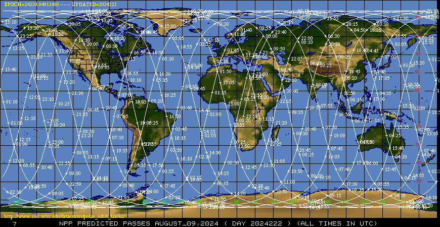

Low-Earth orbit
===============

JPSS
----

VIIRS
~~~~~

CrIS
~~~~

ATMS
~~~~

NUCAPS
~~~~~~

MetOp
-----

Oribt tracks
------------

The University of Wisconsin -- Madison Space Science and Engineering Center provides a resource to see `historical and future tracks <https://www.ssec.wisc.edu/datacenter/polar_orbit_tracks/>`_ (next few days) for many polar-orbitting satellites.

