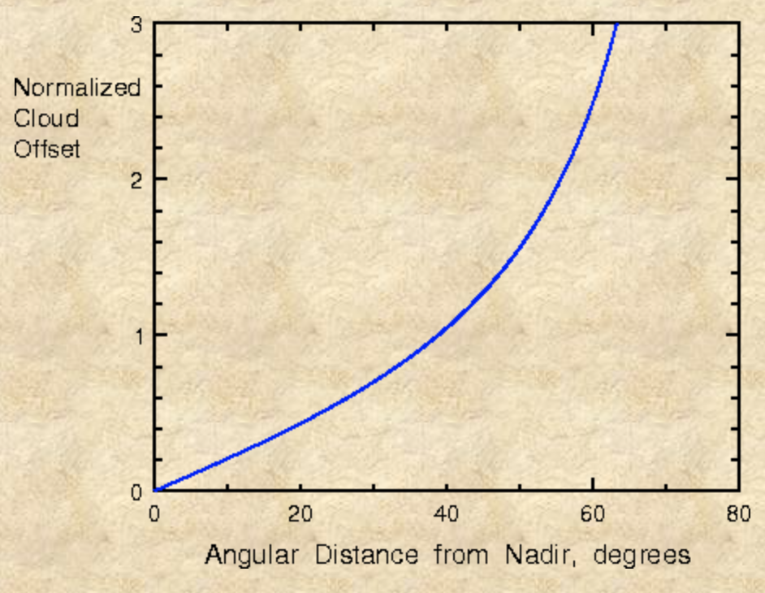
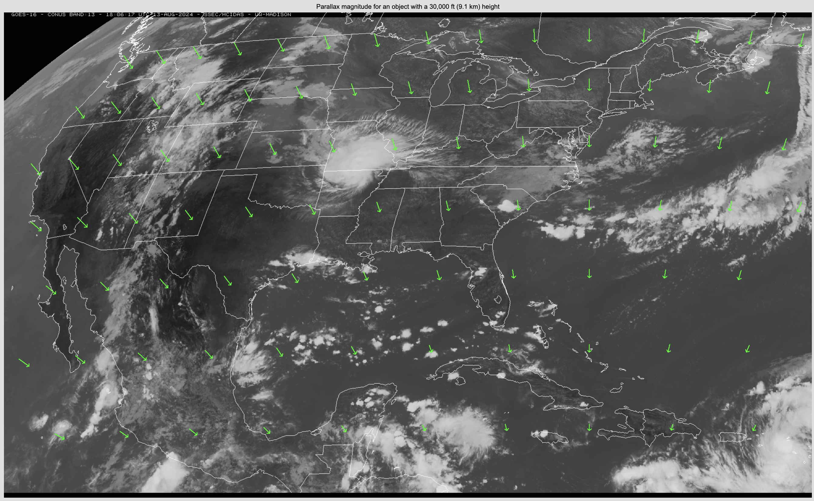

Utilities
=========

This section provides examples and utilities for some common problems. The source code is found in the ``src`` directory of this repo.

Parallax correction
-------------------

For geostationary satellite data in particular, the affects of parallax are a big issue. Because the Earth is (nearly) round and geostationary satellites are very far away ( ), the apparent position of objects above the surface of the earth (such as clouds) can be considerably displaced from their actual ground-relative location. This displacement is a function of the position of the cloud relative to the satellite (i.e., the satellite-viewing angle) and a function of the height of the cloud above the surface of the Earth. These figures from the University of Wyoming help to illustrate. 

.. image:: ../_static/images/parallax_1.gif
    :width: 400
    :alt: Schematic diagram showing effects of parallax

A geostationary satellite's nadir point is at the equator. At this point, high clouds and low clouds have no displacement. But everywhere else, high clouds are displaced more than low clouds. Comparing the high cloud and low cloud in approximately the mid-latitudes, we can see that the cloud edge closer to the equator is displaced much further poleward (i.e., away from the satellite) for the high cloud than the low cloud. In this example, assuming an 18-km cloud top and a 3-km cloud top at a viewing angle of 52 degrees, the parallax displacements are 30 km and 5 km, respectively. Moving that same low cloud closer to the pole, the parallax displacement accelerates quickly.

From this graph, we can see that the normalized cloud offset increases exponentially as the angular distance from nadir increases. For example, for a cloud top at 10 km AGL, and a satellite-viewing angle 60 degrees, the displacement is ``10 * 2.6 = 26 km``.

To visualize the effects of parallax in GOES data, `this CIMSS page <https://cimss.ssec.wisc.edu/goes/webapps/parallax/overview.html>`_ is a handy resource. For instance, the image below shows the relative effects of parallax over the CONUS sector for a cloud at 30 kft (the vectors are exaggerated).

Parallax-correction example
~~~~~~~~~~~~~~~~~~~~~~~~~~~

Explore this `example notebook <https://colab.research.google.com/drive/1m2m1tcqgRFZf6j06zdy0oQ_8DKFC6hCb#scrollTo=asemEOB0EH4X>`_ on performing a parallax correction using a constant-cloud-height assumption and GOES-East data.

.. toctree::
    :maxdepth: 1

    Parallax

.. seealso::

    - `Why is my GOES-16 imagery displaced? Parallax! <https://satelliteliaisonblog.com/2017/04/19/why-is-my-goes-16-imagery-displaced-parallax/>`_
    - `The problem of parallax <https://cimss.ssec.wisc.edu/satellite-blog/archives/217>`_
    - `GOES East/West GLM compared <https://satelliteliaisonblog.com/2019/07/09/goes-east-west-glm-compare-and-glm-parallax/>`_
    - `High-Resolution Satellite Imagery for Mesoscale Meteorological Studies <https://doi.org/10.1175/1520-0477(1994)075%3C0005:HRSIFM%3E2.0.CO;2>`_

Satellite-viewing angle
-----------------------

The satellite-viewing angle (or satellite-zenith angle) is proportional to the pixel area for a geostationary satellite. As this angle increases, the pixel area increases. In the figure below, the satellite-zenith angle is the angle between an observer's zenith (looking straight up) and the line connecting the observer and the satellite [image credit: Royal Belgian Institute for Space Aeronomy].

.. image:: ../_static/images/vza-sza.gif
    :width: 500
    :alt: Cartoon showing the satellite-zenith and solar-zenith angles

This could be helpful to calculate, as one may wish to characterize an analysis as a function of satellite-zenith angle, to discriminate between "near-nadir" locations, "limb" locations, and those in-between. The "limb" is the term generally referred to as those locations on the extremeties of the satellite field of view. For geostationary satellites, the "limb" is generally satellite-zenith angle ≥ 85 degrees.

The function `sat_zen_angle.py <https://github.com/jlc248/satellite-resources/blob/main/src/sat_zen_angle.py>`_ will compute the satellite-zenith angle for a geostationary satellite.

.. toctree::
    :maxdepth: 0

    Satellite-Zenith Angle

Solar-zenith angle
------------------

