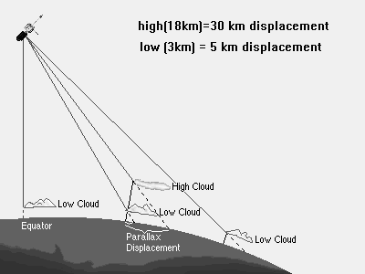

Utilities
=========

This section provides examples and utilities for some common problems. The source code is found in the ``src`` directory of this repo.

Parallax correction
-------------------

For geostationary satellite data in particular, the affects of parallax are a big issue. These figures from the University of Wyoming help to illustrate. Because the Earth is (nearly) round and geostationary satellites are very far away ( ), the apparent position of objects above the surface of the earth (such as clouds) can be considerably displaced from their actual ground-relative location. This is a function of the position of the cloud relative to the satellite (i.e., the satellite-viewing angle) and a function of the height of the cloud. 

.. image:: ../_static/parallax_2.png
    :width: 400
    :alt: Graph of normalized cloud offset as a function of the angular distance from nadir.

Solar-zenith angle
------------------

Satellite-viewing angle
-----------------------
